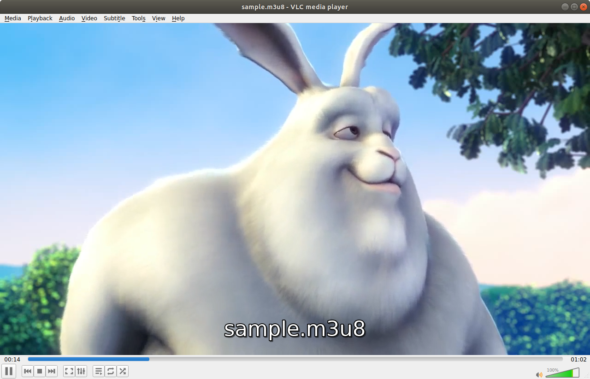
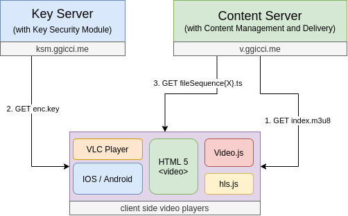

**HTTP Live Streaming** (HLS) is an HTTP-based adaptive bitrate streaming communications protocol developed by Apple Inc. and released in 2009.

Some key points of HLS:

0. Created by Apple.
1. Consists of a playlist/manifest file (e.g. index.m3u8) and segment video files (e.g. index01.ts).
2. H264 codec of video + AAC of audio.
3. Use HTTP, easily leveraging CDN to reach the widest audience without worring about the bandwidth and firewalls.
4. Adaptive streaming, enables changing the quality of the video mid-stream.
5. Widely supported across devicies and platforms. PC, mobile, Web, IOS, Andorid, etc.

## Preface

Let's start from an sample video, which can be downloaded from [vimeo](https://vimeo.com/347119375). In this post, we are going to:

1. Convert the sample video from MP4 to HLS (a `.m3u8` playlist file and `.ts` segment files) with AES-128 encryption method;
2. Serve the key files on a **key server**;
3. Serve the HLS files on a **content server**;
4. Test the deployment with [VLC player](https://www.videolan.org/vlc/) and [video.js](https://videojs.com/).

## 🔄 Transcode (MP4 -> HLS)

The original sample video was in `.mp4` format. While we need HLS files to serve with. We can use [`ffmpeg`](https://www.ffmpeg.org/) to do the transcoding.

**Without AES-128**, we can simply run the following command:

> https://gist.github.com/lukebussey/4d27678c72580aeb660c19a6fb73e9ee

```bash
ffmpeg -i sample-video.mp4 -codec: copy -start_number 0 -hls_time 10 -hls_list_size 0 -f hls sample-noaes.m3u8
```

Open `sample-noaes.m3u8` with VLC player. You should see it playing well.

**With AES-128**, we need to firstly generate an encryption key and an optional IV (initialization vector) for the AES algorithm.

```bash
openssl rand 16 > enc.key  # Key to encrypt the video
openssl rand -hex 16       # IV
# de0efc88a53c730aa764648e545e3874
```

And then make a key info file having the following content:

```text
KEY URI
Path to the key file
IV (optional)
```

Which is used by `ffmpeg`. e.g. `enc.keyinfo`:

```text
https://ksm.ggicci.me/e9672408-b38b-4465-ab47-519c554ae402/enc.key
enc.key
de0efc88a53c730aa764648e545e3874
```

- The first line is the URI of the key. Which will be written to m3u8 file. And the player will consult this URI for the key to decrypt the segments files while playing.
- The second line is the path to the file containg the encryption/decription key.
- The third line is an optional initialization vector.

Now then, we can feed it to `ffmpeg` to do the transcoding again. But this time, we should get an encrypted version of the output:

```bash
ffmpeg \
  -i sample-video.mp4 \  # input file
  -hls_time 9 \ # 9s for each chunk
  -hls_key_info_file enc.keyinfo \ # encryption key
  -hls_playlist_type vod \ # video on demand mode
  -hls_segment_filename "sample-%d.ts" \ # name the segment files in pattern
  sample.m3u8 # HLS playlist (aka. HLS manifest)
```

Open `sample.m3u8` with VLC. It **won't** play. Because VLC tried to retrieve the key file from this URI https://ksm.ggicci.me/e9672408-b38b-4465-ab47-519c554ae402/enc.key as noted in `sample.m3u8`. But it failed. Since we don't have this **key server** ready, yet.

## 🔑 Start a Key Server

Let's serve our key file `enc.key` on a web server and make it accessible from the URI above. Then go back to check if VLC can play this `sample.m3u8`.

I recommend using [Caddy](https://caddyserver.com/) to start up a web server. Which should be easy to learn. Sample site configuration in the Caddyfile:

```Caddyfile
ksm.ggicci.me {
  log {
    level INFO
  }

  tls {
    alpn http/1.1
  }

  file_server {
    root /var/www/ksm.ggicci.me
  }
}
```

Copy file `enc.key` to our web server in the path specified by the URI. And open `sample.m3u8` again. This time it should work, since the key URI became accessible.



## 🎞️ Start a Content Server

So far, our encryption key file has been served well on our key server. As long as we move our video content to a web server, too. We can consume our videos online with assistance of video players. We call it a **Content Server**.

Again, we use Caddy to achieve our goal:

```Caddyfile
v.ggicci.me {
  log {
    level INFO
  }

  tls {
    alpn http/1.1
  }

  file_server {
    root /var/www/v.ggicci.me
    index index.html
  }
}
```

Copy the playlist file and segment files to the web server. Under `/sample` folder in my case. And it's now accessible at https://v.ggicci.me/sample/index.m3u8. Try open it with VLC player (Media > Open Network Stream...). It should work like a charm.

## 📺 Use of video.js

Now that we have set up servers to host our stream. Why not host a video player, too? Thus we can consume our videos through web browsers!

Here we will try [video.js](https://videojs.com/) - the world's most popular open source HTML5 player framework.

With a little research on its official documentation. We can compose a test HTML like this:

```html
<!DOCTYPE html>
<head>
  <link href="https://vjs.zencdn.net/7.11.4/video-js.css" rel="stylesheet" />
</head>

<body>
  <video
    id="my-video"
    class="video-js"
    controls
    preload="auto"
    height="420"
    poster="/sample/cover.png"
    data-setup="{}"
  >
    <source src="/sample/index.m3u8" type="application/x-mpegURL" />
    <p class="vjs-no-js">
      To view this video please enable JavaScript, and consider upgrading to a
      web browser that
      <a href="https://videojs.com/html5-video-support/" target="_blank"
        >supports HTML5 video</a
      >
    </p>
  </video>

  <script src="https://vjs.zencdn.net/7.11.4/video.min.js"></script>
</body>
```

Since we need to read encryption key files from `ksm.ggicci.me` on `v.ggicci.me`. We will meet [CORS](https://en.wikipedia.org/wiki/Cross-origin_resource_sharing) problem. Solving it by adding corresponding headers to `ksm.ggicci.me`'s site configurations:

```Caddyfile
ksm.ggicci.me {
  log {
    level INFO
  }

  tls {
    alpn http/1.1
  }

  file_server {
    root /var/www/ksm.ggicci.me
  }

  header {
    Vary "Origin"
    Access-Control-Allow-Origin "https://v.ggicci.me"
    Access-Control-Allow-Methods "OPTIONS, HEAD, GET"
  }
}
```

Visit https://v.ggicci.me/sample to see the result. Also try it with your mobile devices :)

## Architecture



## References

- [Apple Developer - HTTP Live Streaming](https://developer.apple.com/streaming/)
- [HLS Encryption: How to Encrypt Videos in AES-128 For HTTP Live Streaming [2021 Update]](https://www.dacast.com/blog/hls-encryption-for-video/)
- [Apple FPS - FairPlay Streaming](https://developer.apple.com/streaming/fps/)
