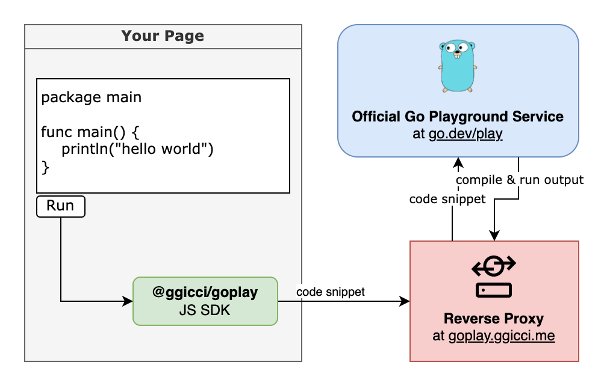

This post is introducing a way to run Go snippets on websites. Which leveraged the official Go Playground service at https://go.dev/play/.

## Demo

Let's take a quick look at the two demos below. You can click the `Run` button to see the output of the corresponding program. Click `Try it yourself` or `Share` button to open the code in the official Go Playground to further edit/test the code on your hand.

{}

```go
package main

func main() {
	println("hello world")
}
```

{}

{}

```go
package main

import (
	"fmt"
	"net/http"
	"net/http/httptest"

	"github.com/ggicci/httpin"
	"github.com/justinas/alice"
)

type ListUsersInput struct {
	Page    int64  `in:"query=page;default=1"`
	PerPage int64  `in:"query=per_page;default=20"`
	Token   string `in:"header=x-access-token;required"`
}

func ListUsers(rw http.ResponseWriter, r *http.Request) {
	input := r.Context().Value(httpin.Input).(*ListUsersInput)
	fmt.Printf("input: %#v\n", input)
	rw.WriteHeader(204)
}

func main() {
	r, _ := http.NewRequest("GET", "/?page=3", nil)
	r.Header.Set("X-Access-Token", "secret...")
	handler := alice.New(
		httpin.NewInput(ListUsersInput{}),
	).ThenFunc(ListUsers)
	rw := httptest.NewRecorder()
	handler.ServeHTTP(rw, r)
}
```

{}

## How it works?



Since we were not able to make AJAX requests directly to [`go.dev`](https://go.dev/play) because of [CORS](https://developer.mozilla.org/en-US/docs/Web/HTTP/CORS) issue.
I setted up a **reverse proxy** `goplay.ggicci.me`, which works as a downstream of `go.dev`. It is responsible to make requests on behalf of the clients to `go.dev` and return the response back to the clients.

I also implemented a simple JS SDK [`@ggicci/goplay`](https://github.com/ggicci/goplay) to easily interact with the go playground service. Use it on your page to connect to your own reverse proxy and run go snippets.

### Set up a reverse proxy to `go.dev`

#### with [**Caddy**](https://caddyserver.com/):

```Caddyfile
goplay.ggicci.me {
    header {
      # https://developer.mozilla.org/en-US/docs/Web/HTTP/Headers#cors
      access-control-allow-origin      "https://ggicci.me"
      access-control-allow-headers     "content-type"
      access-control-allow-methods     "OPTIONS,HEAD,GET,POST"
    }

    # only proxy the playground API of go.dev/play
    route /_/* {
      reverse_proxy https://go.dev {
        header_up Host go.dev
      }
    }

    respond 404
}
```

### Use `@ggicci/goplay`

Here's a quick view demonstrating how to use `@ggicci/goplay`. It implemented a class `GoPlayProxy` with 4 primary APIs:

```js
class GoPlayProxy {
  // CTOR: specify a proxy url to connect
  constructor(public proxyUrl: string = '/goplay') {}
  // compile source code and get JSON response
  public async compile(sourceCode: string, goVersion?: CompilerVersion): Promise<CompilerResponse>
  // same as `compile`, but renders the JSON response as an `HTMLElement`
  public async renderCompile(sourceCode: string, goVersion?: CompilerVersion): Promise<HTMLElement>
  // renders the output of `renderCompile` into the specified container
  public async renderCompileTo(container: HTMLElement, sourceCode: string, goVersion?: CompilerVersion): Promise<void>
  // get the share URL of the source code
  public async share(sourceCode: string, goVersion?: CompilerVersion): Promise<string>
}
```

Visit https://github.com/ggicci/goplay for more details.

```html
<body>
  <!-- the container where to show the output -->
  <div id="goplay-output"></div>
  <button onclick="run()">Run Hello World</button>

  <script type="module">
    import { GoPlayProxy } from "https://unpkg.com/@ggicci/goplay@1.0.0/dist/index.js";
    const GOPLAY_PROXY_URL = "https://goplay.ggicci.me"; // use your own proxy URL
    const goplay = new GoPlayProxy(GOPLAY_PROXY_URL);

    function run() {
      const goCodeSnippet = `
        package main
        
        func main() {
          println("hello world")
        }
        `;

      goplay.renderCompileTo(
        document.getElementById("goplay-output"),
        goCodeSnippet
      );
    }

    window.run = run; // make it visible to the Run button
  </script>
</body>
```

## Hugo Shortcode `goplay`

The following snippet is used by this site.

````html
{{ $id := md5 .Inner }} {{ .Inner }}

<div id="{{ $id }}" class="hugo-goplay-result"></div>
<div class="hugo-goplay-toolbox">
  <button role="button" class="hugo-goplay-button" onclick={{ safeJS (print "goplayRenderCompile_" $id "()") }}>Run</button>
  <button role="button" class="hugo-goplay-button" onclick={{ safeJS (print "goplayOpenShare_" $id "()") }}>
    Try it yourself &#8599;
  </button>
  <button role="button" class="hugo-goplay-button" onclick={{ safeJS (print "goplayOpenShare_" $id "()") }}>Share &#8599;</button>
</div>

<style>
  .hugo-goplay-result .system {
    color: green;
  }
  .hugo-goplay-result .stderr {
    color: red;
  }
  .hugo-goplay-toolbox {
    display: flex;
    justify-content: flex-start;
  }
  .hugo-goplay-toolbox .hugo-goplay-button {
    font-size: 13px;
    font-weight: bold;
    border: 1px solid var(--primary);
    padding: 0.15rem 0.75rem;
    border-radius: 4px;
    margin-left: 0.5rem;
    color: var(--primary);
    background-color: var(--theme);
  }
  .hugo-goplay-toolbox .hugo-goplay-button:hover {
    border: 1px solid var(--theme);
    color: var(--theme);
    background-color: var(--primary);
  }
  .hugo-goplay-toolbox .hugo-goplay-button:first-child {
    margin-left: 0;
  }
</style>

<script type="module">
  import { GoPlayProxy } from "https://unpkg.com/@ggicci/goplay@1.0.0/dist/index.js";

  // FIXME(ggicci): use your own proxy URL, otherwise you may confront with CORS issue.
  const goplay = new GoPlayProxy("https://goplay.ggicci.me");

  function normalizeCode(code) {
    return code
      .trim()
      .replace(/^```go/, "")
      .replace(/^```/, "")
      .replace(/```$/, "")
      .trim();
  }

  const normalizedCode = normalizeCode("{{ .Inner }}")

  window["goplayRenderCompile_" + "{{ $id }}"] = () => {
    goplay.renderCompileTo(
      document.getElementById("{{ $id }}"),
      normalizedCode,
    );
  };

  window["goplayOpenShare_" + "{{ $id }}"] = async() => {
    const shareUrl = await goplay.share(normalizedCode)
    window.open(shareUrl, "_blank").focus();
  };
</script>
````

Read [Hugo - Shortcodes](https://gohugo.io/content-management/shortcodes/) to learn more about hugo shortcodes.

### How to use `goplay` shortcode in hugo?

Save the above snippet under your hugo directory as `$HUGO_ROOT/layouts/shortcodes/goplay.html`. In your markdown file, wrap the code block between `{}` and `{}`.

````markdown
## Sample Code

{}

```go
package main

func main() {
  println("hello world")
}
```

{}
````

## Who is using `@ggicci/goplay`?

- [httpin Documentation](https://ggicci.github.io/httpin/)
- :plus: add yours here by clicking the [**Suggest Changes**](#top) link under the title.
